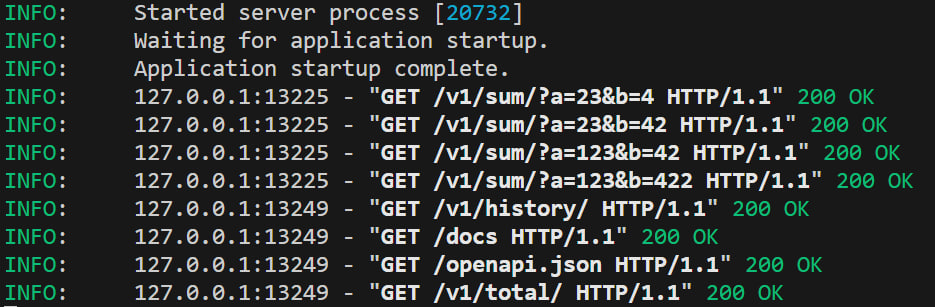
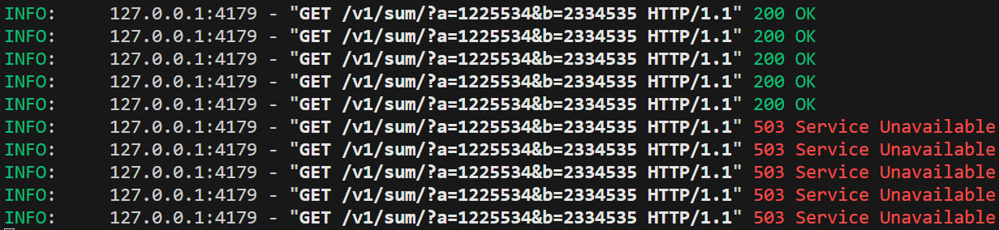
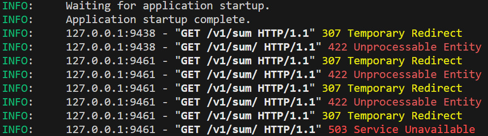

# fastapi-limit-example
FastAPI Limit Example


## Requirements:
- python 3.11
- install dependencies using

```sh
[linux]   pip3 install -r requirements.txt
[windows]  pip install -r requirements.txt
```

- Copy `.env.sample` and rename it to `.env`. Then fill the variables
- Create MongoDb database with name `DorsaDb`
- run command `python -m main` in the root folder.
- redis server. for development you can run docker command:
    `docker run -p 6379:6379 --name redis_service -d redis`


## Run
You can run this project in two ways:

1. Run in development:
    Just run file `main_dev.py` in your IDE to have debugging options.

2. Run in production:
    Execute this command in this directory:
    ```python
    python uvicorn main:app
    ```


## Endpoints
there 3 main endpoints:
1. `v1/sum` for sum up a,b from query parameters.
2. `v1/history` for get all sum requests historiy.
3. `v1/total` for get only total from last requests.




## Limit
For limit api calls, I used redis server to keep api call count. Below is the limiter code:
```python
import redis,os
redis_client = redis.Redis(host=os.getenv('REDIS_HOST'))
def limiter(key, limit):
    req = redis_client.incr(key)
    ttl=60
    if req == 1:
        redis_client.expire(key, ttl)
    else:
        ttl = redis_client.ttl(key)
    if req > limit:
        return {
            "call": False,
            "ttl": ttl
        }
    else:
        return {
            "call": True,
            "ttl": ttl
        }

def call_limiter(ip, limit):
    key=f'call_{ip}'
    return limiter(key, limit)

def bad_call_limiter(ip, limit):
    key=f'bad_call_{ip}'
    return limiter(key, limit)
```

In this project, two kind of limits is implemented:
1. call limiter to limit call of specific endpoint.
2. bad call limiter to limit call of bad request and not found.

You can change throttle time from `THROTTLE` variable in .env file

### Limit Call Example:

```python
@router.get('/sum/', response_model=OperationViewModel)
async def sum_up(request: Request, model: OperationInput = Depends()):
    clientIp = request.client.host
    res = call_limiter(clientIp, 5)
    if not res["call"]:
        raise HTTPException(status_code=status.HTTP_503_SERVICE_UNAVAILABLE,      detail={
            "message": "call limit reached",
            "ttl": res["ttl"]
        })
    total = model.a+model.b
    input_operation = OperationCreating(
        first_operand=model.a, second_operand=model.b, total=total)
    new_operation = await db['operation'].insert_one(input_operation.dict())
    created_operation = await db['operation'].find_one({"_id": new_operation.inserted_id})
    return created_operation
```




### Limit Bad Call Example:

```python
async def not_found_error(request: Request, exc: HTTPException):
    clientIp = request.client.host
    res = bad_call_limiter(clientIp, 3)
    if not res["call"]:
        response = ResponseViewModel(
            message='bad call limit reached',
            status=status.HTTP_503_SERVICE_UNAVAILABLE,
            data={"ttl": res["ttl"]}
        )
        return JSONResponse(response.dict(),status_code=status.HTTP_503_SERVICE_UNAVAILABLE)

    response = ResponseViewModel(
        message='endpoint not found', status=status.HTTP_404_NOT_FOUND)
    return JSONResponse(response.dict(), status_code=status.HTTP_404_NOT_FOUND)


exception_handlers = {404: not_found_error}
```




